## Reto 1

### Evidencias de César
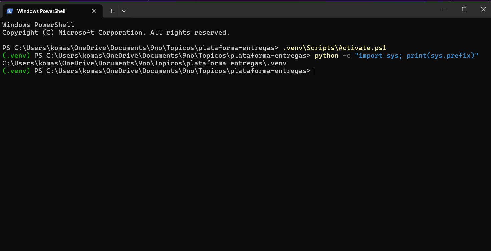
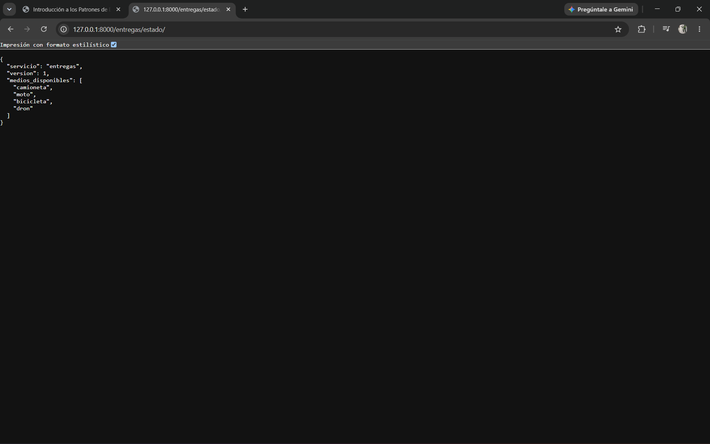

### Evidencias de Annatar
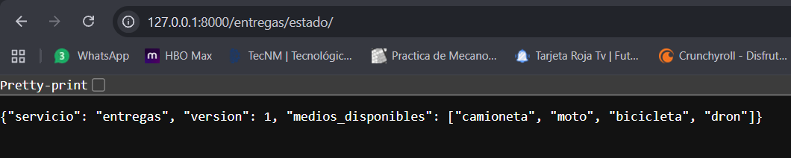

### Evidencias de Merali
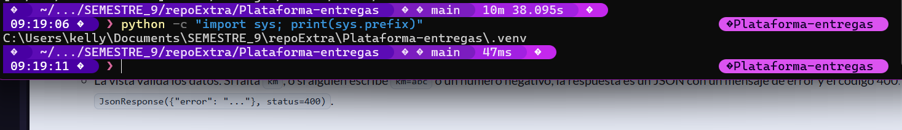
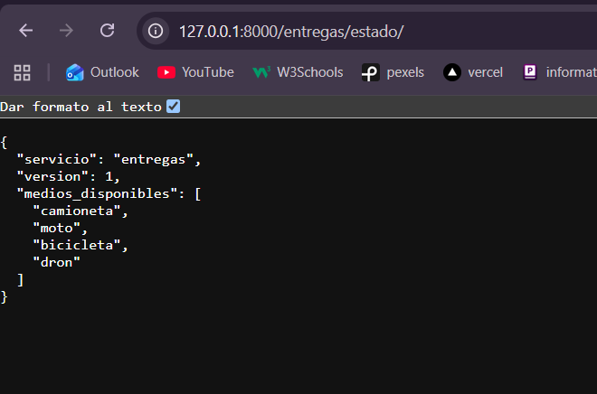

### Evidencias de Daniel
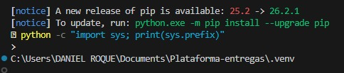
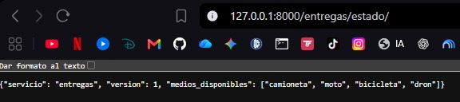

> **Nota del equipo:** Todos los integrantes trabajamos sobre entorno Windows.

---

## Reto 2

### Evidencias de César

#### Código de `reglas.py`
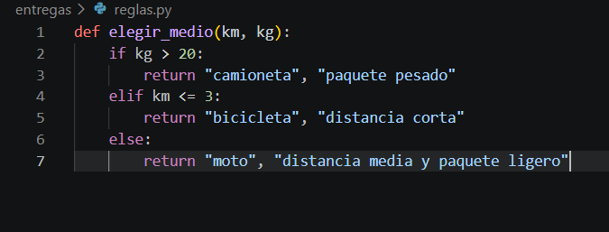

#### Salidas de pruebas
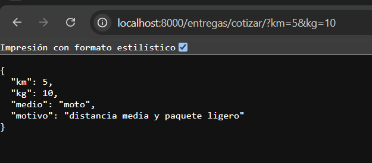
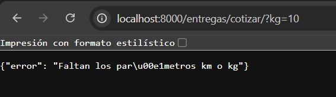

---

### Evidencias de Annatar

#### Código de `reglas.py`
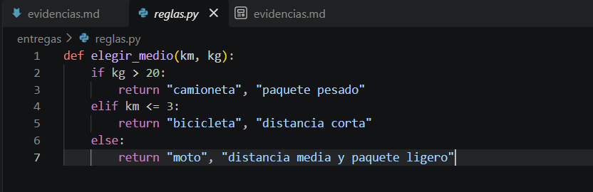

#### Salidas de pruebas
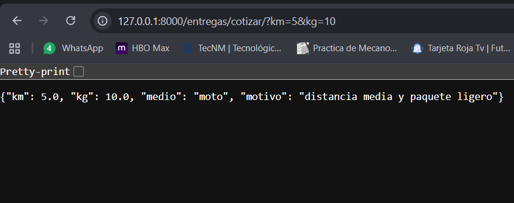
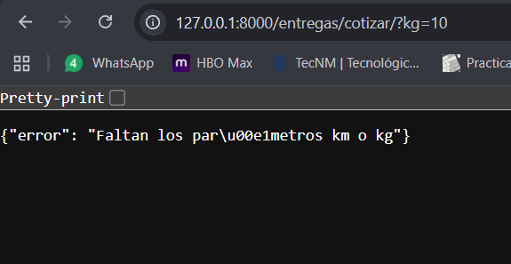
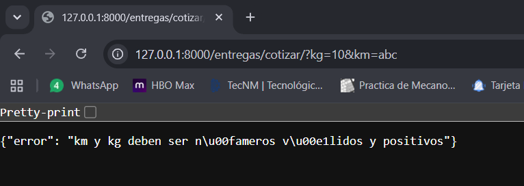

---

### Evidencias de Merali

#### Código de `reglas.py`
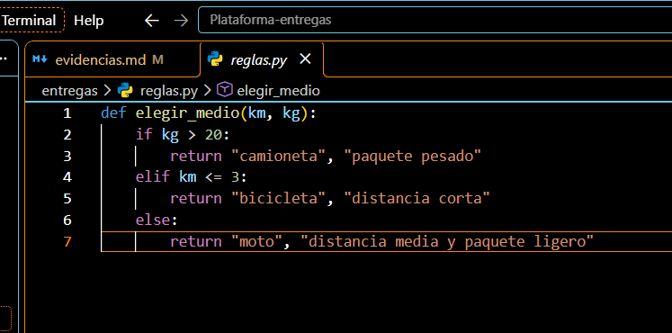

#### Salidas de pruebas
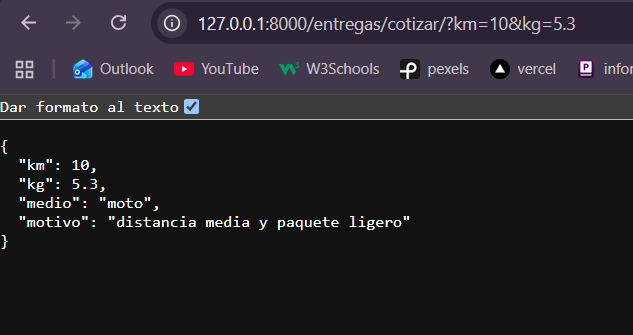
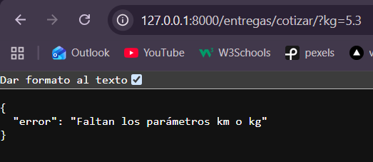
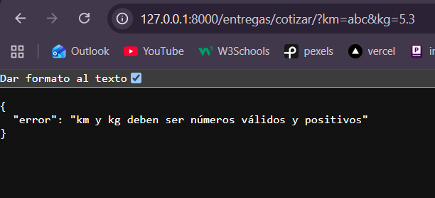

---

### Evidencias de Daniel

#### Código de `reglas.py`
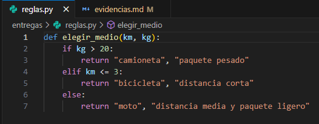

#### Salidas de pruebas
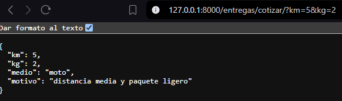
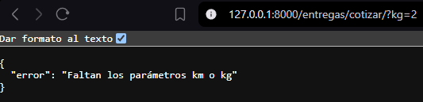
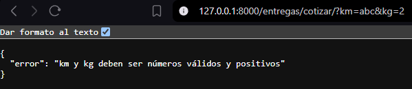

---
## Preguntas de Reflexión

### ¿Por qué la validación tiene que estar en el backend, aunque la app móvil ya revise que el campo no esté vacío?
Por **seguridad e integridad de los datos**. Un usuario malintencionado puede saltarse la interfaz móvil y enviar peticiones directamente a la API utilizando herramientas como Postman, cURL o scripts automatizados. Además, al integrar múltiples clientes (web, iOS, Android, etc.), el backend funciona como la única barrera centralizada de defensa, garantizando que no se ingresen datos inválidos o corruptos a la base de datos sin importar la fuente de la petición.

### ¿Qué patrón de los apuntes reemplazaría la cadena de `if` y qué ganarían con eso?
El patrón adecuado para sustituir condicionales de reglas de negocio anidadas es el **Patrón Strategy** o la **Cadena de Responsabilidad (Chain of Responsibility)**.

**Ganancias principales:**
* **Principio de Abierto/Cerrado (Open/Closed Principle):** Permite extender nuevos medios de entrega (como drones o vehículos autónomos) añadiendo nuevas clases o módulos independientes sin modificar el código core existente.
* **Reducción de Complejidad Ciclomática:** Elimina los `if/elif` anidados, facilitando la lectura y mantenimiento del código.
* **Aislamiento y Pruebas Unitarias:** Cada regla de validación se evalúa de forma independiente, lo que simplifica la creación de pruebas unitarias específicas sin riesgo de romper otras reglas.