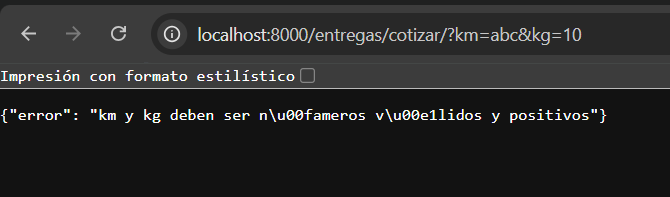

Reto 1:

Todos tenemos windows

Reto 2:

Evidencia de codigo de reglas.py

Salidas:

¿Por qué la validación tiene que estar en el backend, aunque la app móvil ya revise que el campo no esté vacío?
Por seguridad e integridad de los datos. Un usuario malintencionado puede saltarse la aplicación móvil y enviar peticiones directas a la API usando herramientas como Postman, cURL o un script de Python. Además, si en el futuro desarrollas más clientes , el backend actúa como la única barrera de defensa, garantizando que no entren datos corruptos a tu sistema sin importar el origen de la petición.

¿Qué patrón de los apuntes reemplazaría la cadena de if y qué ganarían con eso?
El patrón ideal para reemplazar múltiples condicionales enfocados en reglas de negocio es el Patrón Strategy o la Cadena de Responsabilidad.

Lo que ganarían: Cumplir con el principio de Abierto/Cerrado. Podrán agregar el dron o un quinto medio de entrega creando un nuevo bloque de regla sin modificar el código de la función original. Esto elimina la complejidad ciclomática de los if anidados, reduce el riesgo de romper lógica existente y permite que cada regla de entrega se pueda someter a pruebas unitarias por separado.